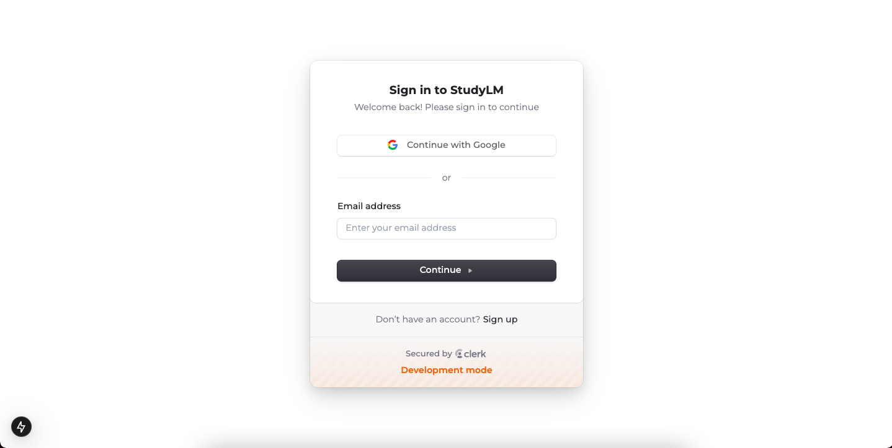
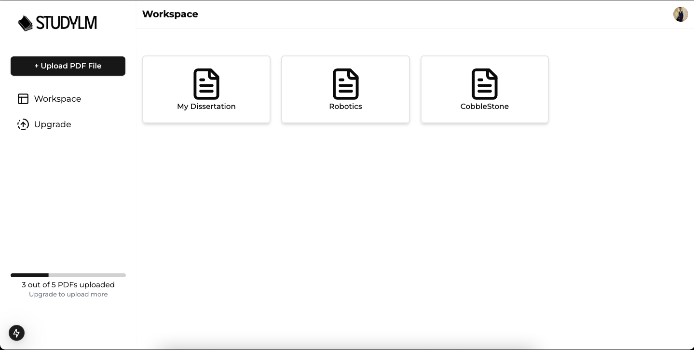
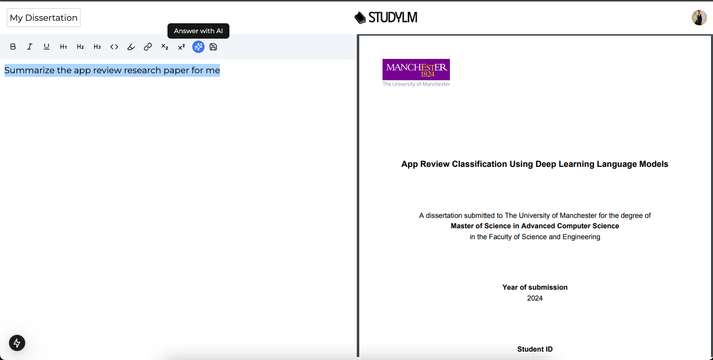
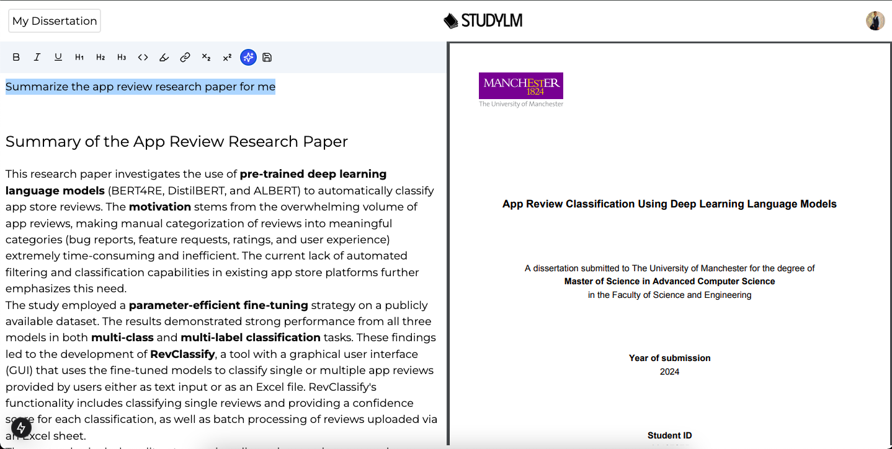
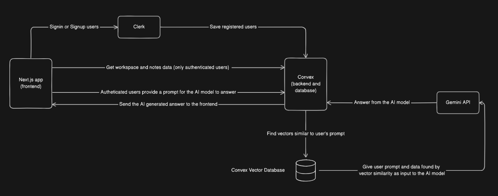

## AI Note Taking Application

This is a Next.js application designed to take notes and leverage AI to enhance the note-taking experience.

### Features

* **Seamless Note Taking:** Create, edit, and organize your notes with a user-friendly interface.
* **AI-powered Insights:** Utilize Langchain and Gemini to generate summaries, ask questions, and gain deeper understanding from your notes.
* **Secure and Scalable:** Secure user authentication with Clerk and a robust backend powered by Convex (Backend-as-a-Service).
* **Modern Design:** Tailwind CSS ensures a clean and responsive user interface for a smooth experience across devices.

### Technologies Used

* Frontend: Next.js
* Backend: Convex
* Authentication: Clerk
* AI Integration: Langchain, Gemini
* Styling: Tailwind CSS

### Getting Started

1. **Clone the repository:**

   ```bash
   git clone https://github.com/mehdi1514/StudyLM.git
   ```

2. Install dependencies
    ```bash
    cd ai-note-taking-app
    npm install
    ```

3. Configure environment variables:
    Create a .env.local file in the project root. Add your own environment variables. Refer to the example.env.local file and replace the empty values with your actual values.

    Note: you will need to create an account on convex and create a new project. You also would have to create an account for Geminin API and create an API key.

4. Run the application:
    ```bash
    npm run dev
    ```
    This will start the development server and open the application in your default browser at http://localhost:3000.

## Screenshots





## Architecture

